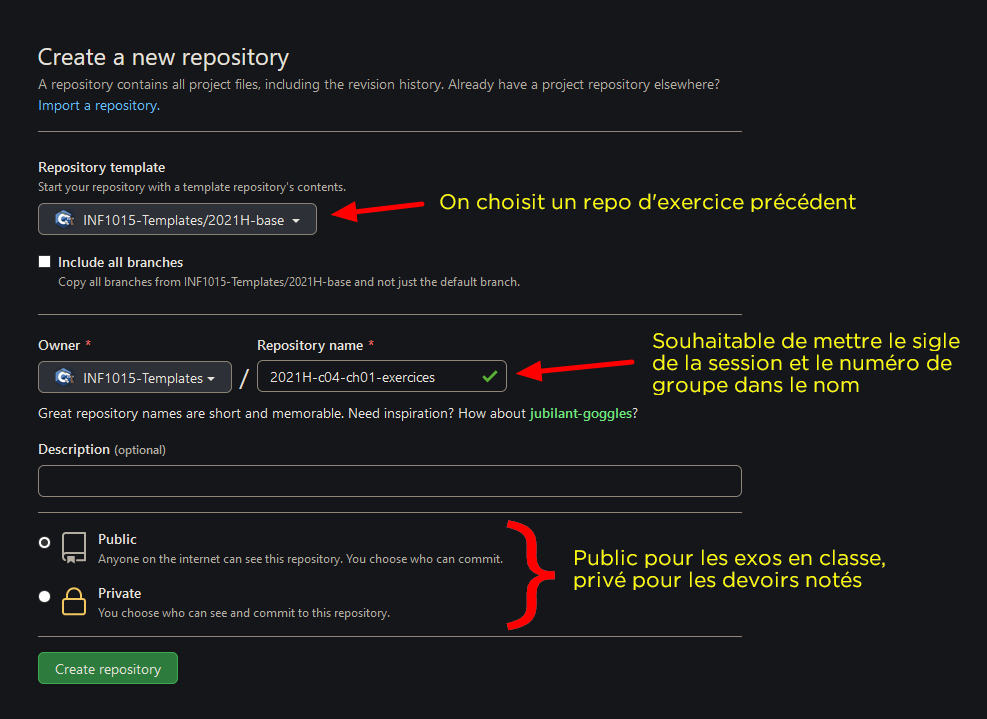
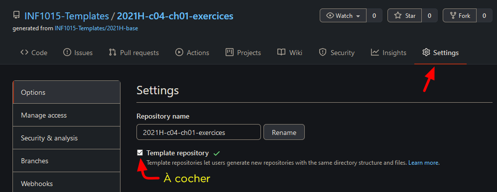
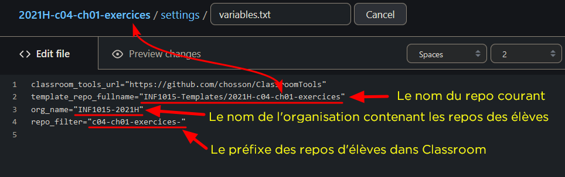
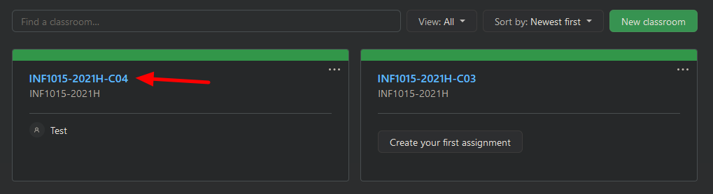
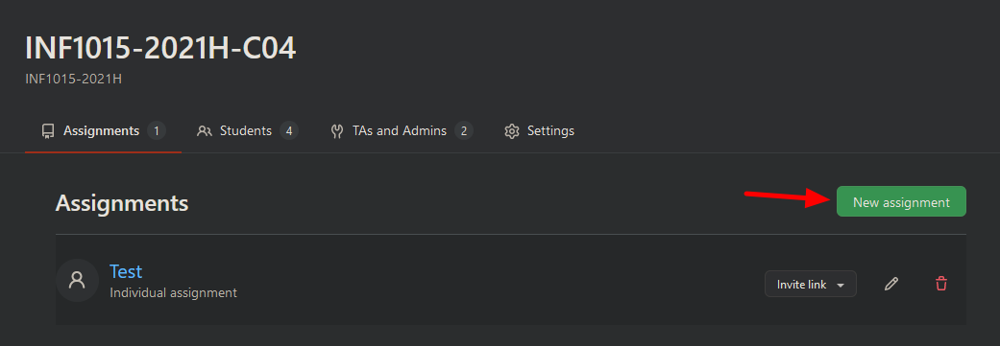
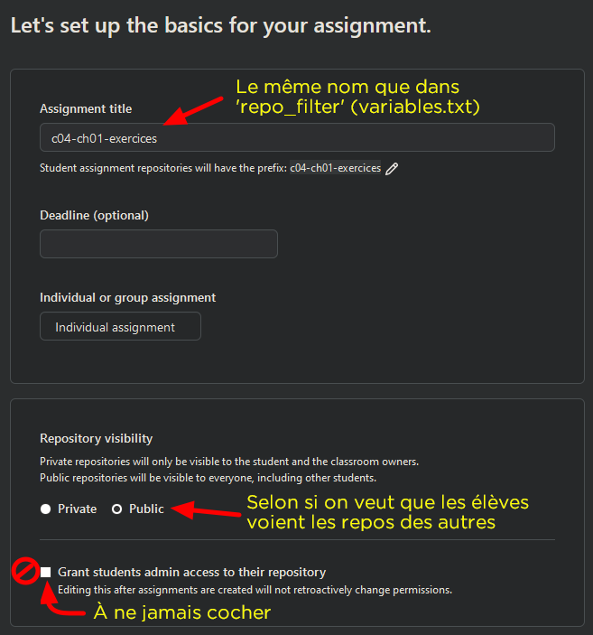
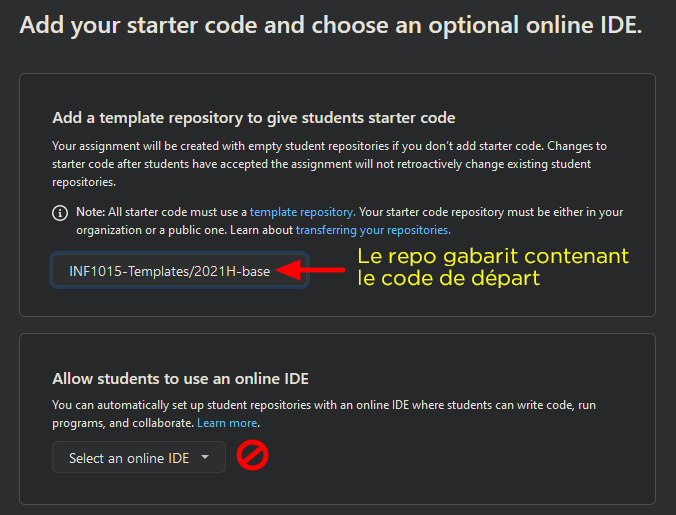
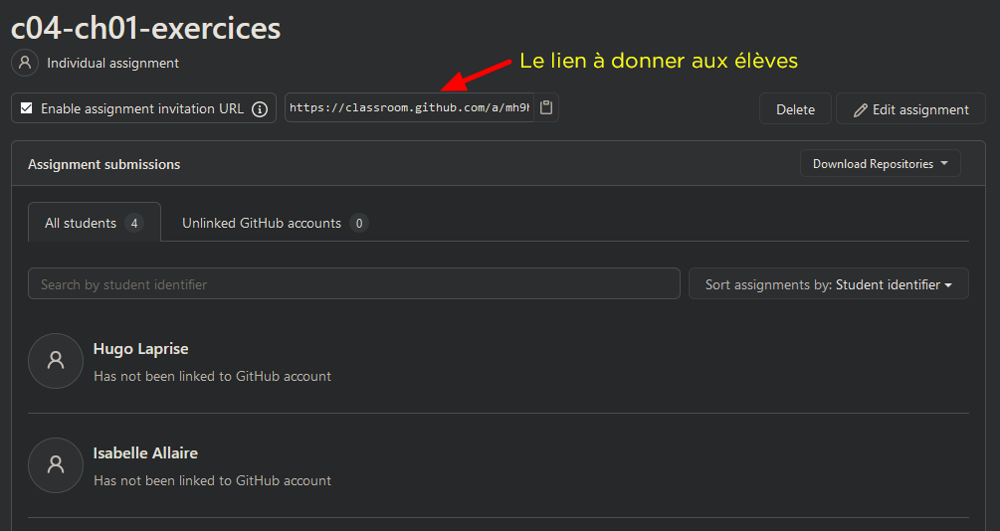
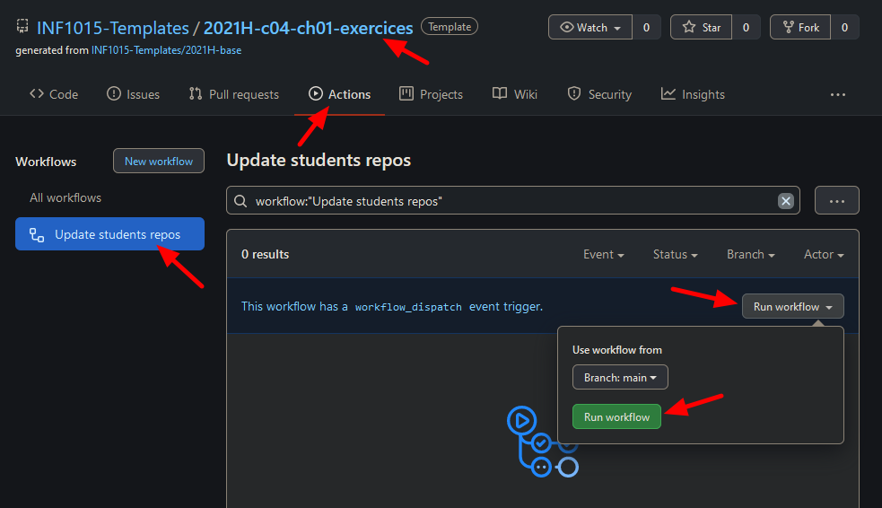
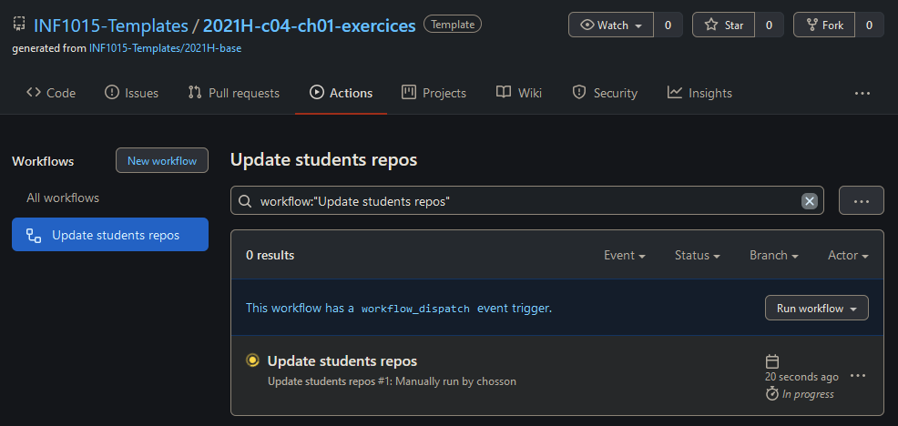

# Procédure pour créer un exercice.

## TL;DR

1. Créer le repo pour le code de départ dans l'organisation contenant les templates ([github.com/INF1015-Templates](https://github.com/organizations/INF1015-Templates)) à partir d'un repo d'exercice existant ou à partir du repo de base (celui dont ce Readme fait partie).
2. Donner un nom qui contient le session et le groupe puis choisir la visibilité selon les besoins.
3. Mettre à jour [settings/variables.txt](../settings/variables.txt) en mettant le nom du repo courant dans la variable `template_repo_fullname`, le nom de l'organisation contenant les repos d'élèves dans `org_name` et le préfixe du devoir dans `repo_filter`.
4. Créer le devoir dans le classroom désiré en lui donnant le même nom que dans `repo_filter` de [settings/variables.txt](../settings/variables.txt), moins le dernier trait.
5. Choisir le repo de code de départ créé précédemment, ne jamais donner accès admin aux élèves pour leurs repos.
6. Pour mettre à jour les repos des étudiants, rouler l'action *Update student repos*. Il est mieux de ne pas toucher les fichiers que les élèves modifient.

## 1. Créer le repo gabarit

Il faut d'abord créer un repo qui va contenir le code de départ. On met ce repo dans l'organisation qui contient les gabarits ([github.com/INF1015-Templates](https://github.com/organizations/INF1015-Templates) dans notre cas). On va généralement prendre comme gabarit un repo d'exercices précédent ou le repo du Readme que vous lisez en ce moment. Ça réduit le *boilerplate* à ajouter par la suite tel que les workflows, les fichiers VS, le gitignore, etc.

C'est une bonne idée de mettre le sigle de la session et le numéro de groupe (par exemple 2021H-c04) comme préfixe au nom du repo pour faciliter la gestion des anciens repos dans le futur sans avoir à créer une nouvelle organisation pour les templates chaque session. Par exemple, le repo des exercices en classe du chapitre 1 pour le groupe 4 à l'hiver 2021 pourrait être *2021H-c04-ch01-exercices*.

Pour la visibilité du repo, ça dépend de ce à quoi le repo va servir. C'est mieux de mettre public si c'est pour des exercices en classes ou des exemples, autremen dit si ce n'est pas grave que les étudiants puissent aller voir l'historique des commit. Toutefois, si le repo sert de code de départ pour un devoir noté, il faut le mettre privé, car le solutionnaire sera probablement présent dans l'historique des commits (on écrit le code fonctionnel, puis on enlève les réponses et ajoute les *TODO*). Il est important de noter que les actions faites sur les repos privés coûtent de précieuses minutes de Github Actions.

## 2. Mettre à jour la configuration

Dans les settings sur Github, on indique que le repo est un gabarit.

Ensuite, on met à jour [settings/variables.txt](../settings/variables.txt) en mettant le nom du repo courant dans la variable `template_repo_fullname`, le nom de l'organisation contenant les repos d'élèves dans `org_name` et le préfixe du devoir dans `repo_filter`. Dans ce dernier on peut omettre la session et le groupe vu que la classe dans Github Classroom aura probablement déjà cette information dans le nom. Ce filtre nous permet de mettre à jour les repos des étudiants créés dans Classroom à partir des commits dans le gabarit.

Notez le `-` à la fin du filtre. En effet, les noms des repos des élèves auront la forme `<nom du devoir>-<username de l'élève>`. Par exemple, pour le devoir `c04-ch01-exercices`, l'élève `foobarqux` aura le repo `c04-ch01-exercices-foobarqux` dans l'organisation donnée (donc `INF1015-2021H/c04-ch01-exercices-foobarqux` dans notre exemple).

Dans [settings/files_to_update.txt](../settings/files_to_update.txt), on met les fichiers qui doivent être synchronisés dans les repos des étudiants lorsque qu'on lance l'action *Update students repos* (définie dans [update_student_repositories.yml](../.github/workflows/update_student_repositories.yml)). Pour les solutionnaires, c'est souhaitable de les mettre dans des fichiers séparés de ceux dans lesquels les étudiants travaillent (les fichiers de départ avec les *TODO*), car on veut pouvoir fournir les solutionnaires à travers un update sans que les étudiants aient à faire un merge en se débarrassant de leur code.

## 3. Créer le devoir (*assignment*) dans Classroom

Il faut aller sur [classroom.github.com](https://classroom.github.com/classrooms) puis se connecter avec son compte Github. Au besoin, il faut accepter que la connexion du service. On sélectionne ensuite la classe (*classroom*) dans laquelle on veut ajouter le devoir ou exercice. Dans notre exemple, on choisit INF1014-2021H-C04 (groupe 4 de cours de la session d'hiver 2021).

On crée ensuite le devoir. On lui donne le même nom que ce qu'on met dans le `repo_filter` de [settings/variables.txt](../settings/variables.txt), moins le dernier trait. Pour la visibilité, on met public si on veut que les étudiants puissent voir les réponses des autres étudiants dans la classe ou privé sinon. Par exemple, un code d'exemple en classe pourrait être exposé, un devoir noté devrait clairement être caché (plagiat). Encore là, il faut penser aux minutes Github pour les repos privés. On ne donne jamais les droits d'administrateur aux élèves pour leurs repos.

On choisit ensuite comme repo gabarit le repo précédemment créé dans lequel on a mis le code de départ. On ne met pas de IDE, d'autograding et de feedback pull requests, ce sont des features incomplètes ou inutiles.

Après avoir confirmé la création du devoir, on a le lien qu'on peut donner aux élèves. Il est bon de noter que le code de départ est copié au moment de l'acceptation du devoir par l'élève, pas au moment de créer le devoir. Donc on peut changer le contenu du repo gabarit après avoir créé le devoir dans Classroom (on peut juste attendre avant de donner le lien aux élèves).

## 4. Faire de modifications aux repos des élèves

On peut mettre à jour des fichiers dans les repos des élèves, par exemple pour corriger des fautes dans le Readme contenant l'énoncé ou dans les fichiers de données fournis, ou pour fournir le solutionnaire à l'exercice demandé. Pour ce faire, on lance l'action *Update student repos* qu'on trouve dans la page *Actions* du repo gabarit. Dépendamment du nombre d'élèves l'exécution peut prendre quelques minutes. Les élèves peuvent ensuite faire un pull sur leur clone local pour obtenir les modifications.

Seuls les fichiers spécifiés dans [settings/files_to_update.txt](../settings/files_to_update.txt) sont touchés par la mise à jour, en plus des workflow qui sont effacés pour éviter les failles potentielles. Il est important d'essayer le moins possible de synchroniser des fichiers que les élèves doivent modifier de leur côté, car la synchronisation va écraser le travail des élèves. S'il faut vraiment le faire, il faut en aviser les élèves pour qu'ils sachent qu'ils doivent restaurer leur travail précédent (la synchronisation est faite à travers des commits et on peut voir ce qui a été modifié).

