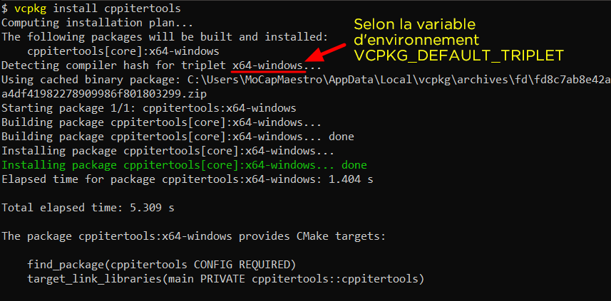
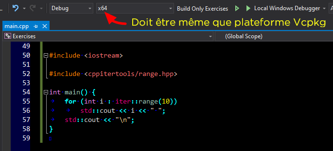
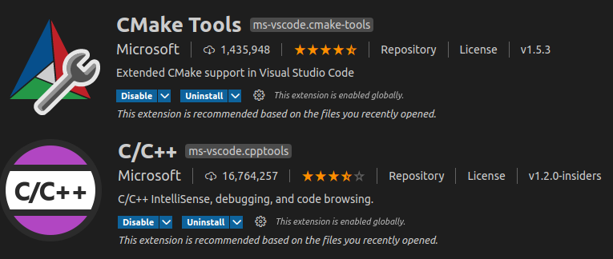
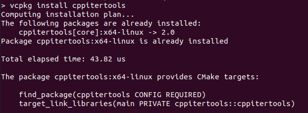
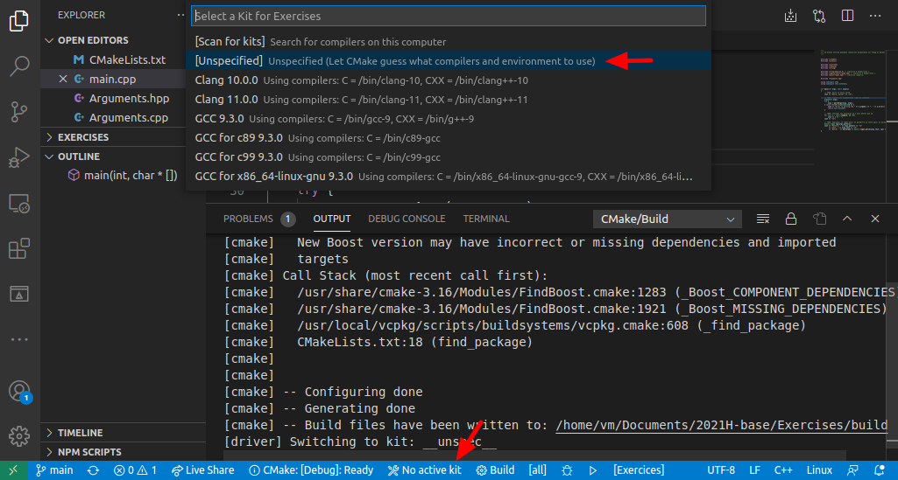
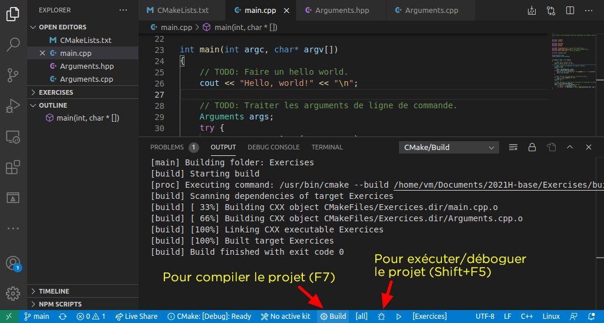

# Utilisation de Vcpkg pour Windows/Linux/Mac

Vcpkg (sur [Github](https://github.com/microsoft/vcpkg)) est un gestionnaire de bibliothèques C et C++ pour Windows, Linux et MacOS développé par Microsoft depuis quelques années. Un peu comme *pip* le fait pour Python, Vcpkg nous permet d'installer aisément et uniformément des bibliothèques en C/C++ dans un projet, sans avoir à se préoccuper des détails d'emplacement et des caprices de chacune des bibliothèques.

## Installation de Vcpkg

La procédure d'installation est sensiblement la même pour les trois plateformes, mais les prérequis sont différents. Vous pouvez suivre les étapes données dans [la documentation officielle](https://github.com/microsoft/vcpkg#getting-started). Comme pour beaucoup d'outils de développement, il est mieux d'installer Vcpkg dans un dossier dont le chemin ne contient pas d'espaces ou d'accents. Sur Windows, `C:\vcpkg` ou `C:\dev\vcpkg` est un bon endroit; sur Unix, `/usr/local/vcpkg` est généralement une bonne idée.


Après avoir complété l'installation, il faut ajouter une variable d'environnement `VCPKG_ROOT` contenant le chemin vers l'installation de Vcpkg (par exemple `/usr/local/vcpkg`). Vous devriez aussi ajouter ce chemin dans votre variable PATH pour plus facilement utiliser l'outil en ligne de commande.

## Utilisation sur Windows avec Visual Studio

L'utilisation la plus simple et la plus transparente de Vcpkg se fait avec Visual Studio, l'IDE de Microsoft (aucune surprise jusque-là). Après avoir fait `vcpkg integrate install`, vous devriez pouvoir installer des bibliothèques et vous en servir dans un projet Visual Studio sans avoir besoin de faire autre chose. Par exemple, si on installe *cppitertools*, on peut ensuite s'en servir dans notre code sans plus d'étapes.

Remarquez la plateforme cible de votre solution (typiquement x86 ou x64). Celle-ci doit correspondre avec la plateforme d'installation de Vcpkg, c'est-à-dire ce qui dit à ce dernier pour quelle plateforme installer les bibliothèques. Sans entrer dans les détails, disons que sur Windows vous avez principalement le choix entre `x86-windows` (32 bit) ou `x64-windows` (64 bit). Vous pouvez changer la plateforme d'installation de Vcpkg par défaut en le mettant dans la variable d'environnement `VCPKG_DEFAULT_TRIPLET`. Si vous ne le spécifiez pas, `x86-windows` est choisi. Parallèlement, la plateforme par défaut dans Visual Studio est aussi x86. Donc si vous ne vous en occupez pas, tout va fonctionner en 32 bit sans que vous ayez à y penser.





<p>

## Utilisation sur Linux/MacOS avec VSCode et CMake

Pour développer nativement sur Linux ou sur MacOS, vous pouvez utiliser Visual Studio Code, un environnement multiplateforme très populaire, et CMake, un système de production (*build system*) aussi très populaire et multiplateforme. Vcpkg s'intègre bien à ces deux outils, mais de façon moins transparente qu'avec Visual Studio.

### Installation de Visual Studio Code

D'abord, installez VSCode de la façon recommandée sur votre système (par exemple le App Store sur MacOS ou son équivalent sur Ubuntu). À travers le gestionnaire d'extensions, installez *C/C++* et *CMake Tools*, tous deux de Microsoft. Ensuite, faites `vcpkg integrate install` (en supposant que vous l'avez installé).



### Création d'un projet avec CMake

Dans le dossier dans lequel vous voulez mettre un projet C++ utilisant CMake, créez un fichier *CMakeLists.txt* puis ouvrez ce dossier dans VSCode. Il faut ensuite ajouter dans le fichier :

1. `cmake_minimum_version()` avec une version (`VERSION 3.0.0` si vous ne savez pas quoi mettre).
2. `set(CMAKE_TOOLCHAIN_FILE "$ENV{VCPKG_ROOT}/scripts/buildsystems/vcpkg.cmake")`. C'est pour cela qu'on a fait une variable d'environnement `VCPKG_ROOT`.
3. `project()` avec le nom de votre projet.
4. `add_executable()` avec le nom du projet (variable `${PROJECT_NAME}`).
5. Les flags de compilation pour GCC ou Clang.


Maintenant, il faut dire à CMake comment intégrer les bibliothèques installées par Vcpkg. Ce dernier, en installant une bibliothèque, nous dit quoi mettre dans le CMakeLists pour que ça fonctionne. Par exemple, si on fait `vcpkg install cppitertools`, on obtient :


On peut obtenir ce message à nouveau en faisant `vcpkg install` pour une bibliothèque déjà installée :



Dans notre *CMakeLists.txt*, on ajoute les lignes que vcpkg nous a dit d'ajouter en remplaçant `main` par `${PROJECT_NAME}` (ou ce qu'on a mis dans `add_executable()`). Si on a plusieurs `target_link_librairies()`, on les joint en énumérant les noms de librairies. Par exemple, si *cppitertools* nous dit de faire :
```
find_package(cppitertools CONFIG REQUIRED)
target_link_libraries(main PRIVATE cppitertools::cppitertools)
```
et que *boost-regex* et *boost-format* nous disent de faire :
```
find_package(Boost REQUIRED [COMPONENTS <libs>...])
target_link_libraries(main PRIVATE Boost::boost Boost::<lib1> Boost::<lib2> ...)
```
alors on met ceci dans CMakeLists.txt :
```
find_package(cppitertools CONFIG REQUIRED)
find_package(Boost REQUIRED COMPONENTS regex format)
target_link_libraries(main PRIVATE cppitertools::cppitertools Boost::boost Boost::regex Boost::format)
```

### Compilation et débogage

Pour compiler et déboguer (ou exécuter) votre code, vous devez dire à VSCode quelle suite d'outils utiliser. Vous pouvez choisir un compilateur particulier, ou choisir *[Unspecified]* pour prendre l'outil par défaut de votre système.



Pour compiler, utilisez le bouton *Build* de l'extension CMake Tools dans la barre de statut (raccourci F7). Pour déboguer, utilisez le bouton de la barre de statut (raccourci Ctrl+F5).



Si vous voulez fournir des options en ligne de commande à votre programme, ajoutez
```json
"cmake.debugConfig": {
    "args": [
        "--une-option",
        "un argument",
        "--une-autre-option",
        "un autre argument"
    ]
}
```
dans *.vscode/settings.json* en mettant ce que vous voulez dans `args: []`, ou bien créez-vous un *launch.json*.

